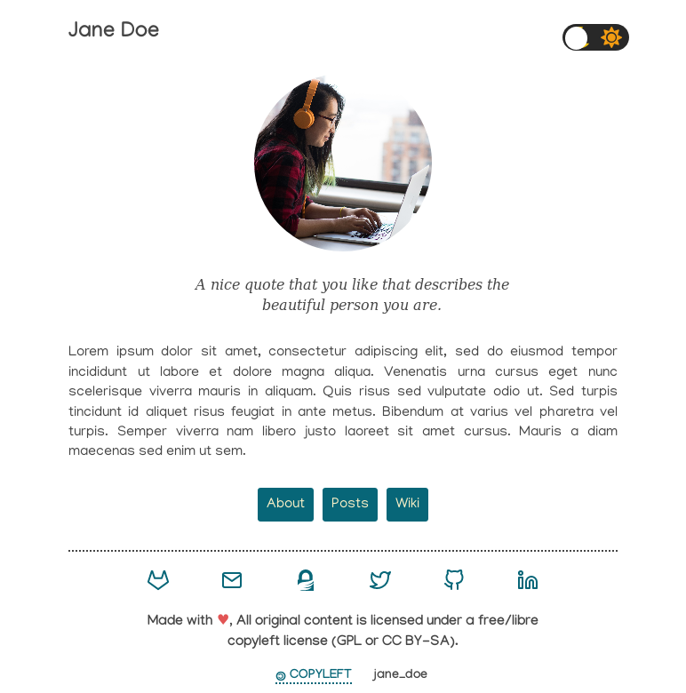
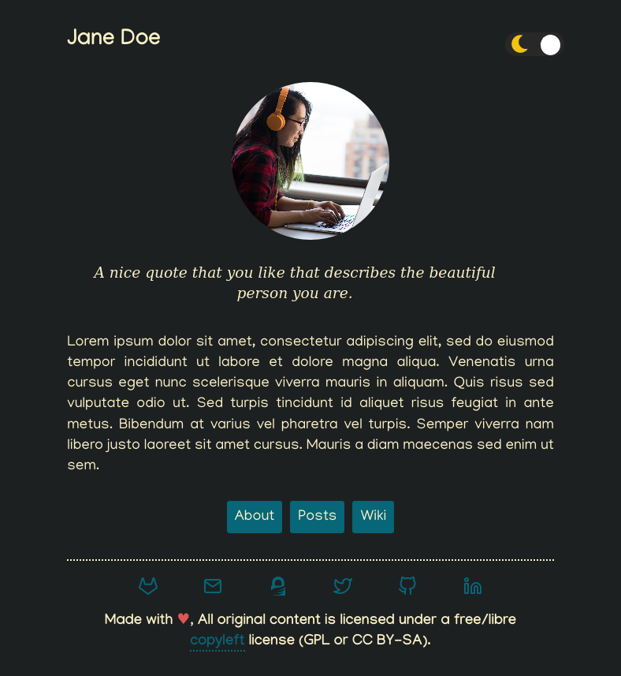

# Gruvhugo
[](https://gitlab.com/avron/gruvhugo/-/commits/master)
[](https://www.gnu.org/licenses/gpl-3.0)

This is a minmal theme based on the [Gruvbox](https://github.com/morhetz/gruvbox) color scheme by [Pavel Pertsev](https://github.com/morhetz/)

# Feature
- **Minimalism is the norm here** 
- **Fast.**
- **Theming**: Persistent color theme, depending on your preference.
- Clean UI
- Intuitive Navigation.
- Highly customizable
  - Every piece of text you see is customizable.
  - Customizable Pictures
  - Customizable Menu 
- Fully responsive
- Support for social media icons

## Screnshots



## Installation
Adding theme as a sub-module is by the most efficient way to do things in my opinion. If you wish to use the theme as it is then all you need to do add the sub-module but if you wish to modify and maintain your own fork of the theme then make the necessary changes to the git remotes as you see fit.

``` sh
$ git submodule add https://gitlab.com/avron/gruvhugo.git
```
## Configuration
Like almost every other Hugo the config file is placed in 
[exampleSite/config.toml](https://gitlab.com/avron/gruvhugo/-/blob/master/exampleSite/config.toml)

## Contributing
Issues and merge requests for bug fixes and enhancements are welcome.

## Licence
The theme is released under the GPL v3 License.
